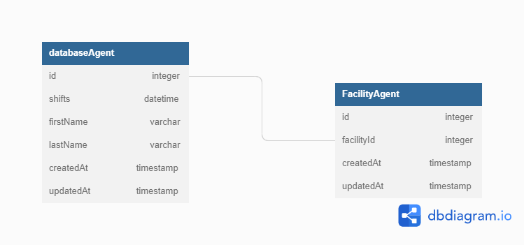

# Ticket Breakdown
We are a staffing company whose primary purpose is to book Agents at Shifts posted by Facilities on our platform. We're working on a new feature which will generate reports for our client Facilities containing info on how many hours each Agent worked in a given quarter by summing up every Shift they worked. Currently, this is how the process works:

- Data is saved in the database in the Facilities, Agents, and Shifts tables
- A function `getShiftsByFacility` is called with the Facility's id, returning all Shifts worked that quarter, including some metadata about the Agent assigned to each
- A function `generateReport` is then called with the list of Shifts. It converts them into a PDF which can be submitted by the Facility for compliance.

## You've been asked to work on a ticket. It reads:

**Currently, the id of each Agent on the reports we generate is their internal database id. We'd like to add the ability for Facilities to save their own custom ids for each Agent they work with and use that id when generating reports for them.**


Based on the information given, break this ticket down into 2-5 individual tickets to perform. Provide as much detail for each ticket as you can, including acceptance criteria, time/effort estimates, and implementation details. Feel free to make informed guesses about any unknown details - you can't guess "wrong".


You will be graded on the level of detail in each ticket, the clarity of the execution plan within and between tickets, and the intelligibility of your language. You don't need to be a native English speaker, but please proof-read your work.

## Your Breakdown Here

## Preface

Allowing a facility to have a custom agent IDs means we will have to create various functions to convert the custom ID to match the database ID. To store the custom IDs, each facility is given a separate table that will point to the database ID. This allows for less duplicate agent info in the database.

The new functions will be an extra layer of communication between facility and database, that converts custom facility IDs into agent database IDs, thus adding onto the existing process.

For the new process, we would need various functions to:
-   Store agent custom ID based on facility and associate new ID with database ID
-   Save shifts associated to agents based on new ID
-   Get all shifts in facility based on Facility's custom agent ID
-   Generate report of agent's list of shifts based on facility's custom ID
-   Generate reports of multiple agents




Breakdown on how the existing process is handled.
```
    function getShiftsByFacility(facilityId) {
        returns shifts worked by Quarter, and agents' info associated with the shifts
    }

    function generateReport(shiftList) {
        converts entire facility shift table to PDF
        returns table as PDF
    }
```
### Ticket #1
Agent database ID is saved as a separate database table based on facility and facility's custom ID. Priorty is on saving individual agent info before working on functionality for processing multiple agents. This is the highest priority ticket, since all the other tickets/functions will rely on calling this function.

#### Acceptance Criteria
Have a function that accepts
-   agent's internal database id
-   facility's custom agent id

Saves the custom id into a separate table belonging to the facility and associated with the agent's database table.

#### Time/Effort estimates
Saving an individual agent's id into the database can be handled in a day, or up to a few days depending on the complexity of the database. I am confident it should not take too long since you are just converting IDs. A potential complexity added would be how the facility is creating the custom IDs (randomly or manually), since you may have to check for duplicate IDs.

#### Implementation details
```
    function agentIDConversion (agentDatabaseId, facilityCustomId)
```
The custom id points to the database ID instead of duplicating agent info per facility to save database space and be more efficient. Allows dynamic flexiblity for every new facility needing access to agent info.

One potential implementation would have the function randomly generate a custom ID based on facility's needs, and check if there are any duplicates in the existing database.

### Ticket #2
Based on the current process, shifts are also saved in the database tables on agent's database ID. We need another function to save shifts associated on facility's custom agent ID.

#### Acceptance Criteria
Have a function that accepts
-   agent's facility custom id
-   shift ID

returns the shift and associated info being saved into the database.

#### Time/Effort estimates
The function has to parse through three different tables (Shifts, Agents, and facilityAgents). Creating and testing the function should take up to a few days or a week, depending on the complexity of the database or any bugs with saving entries. It will call upon existing functionality, so I don't expect many bugs.

#### Implementation details
```
    function saveFacilityShift(agentCustomId, shiftId)
```
Calls upon the agentIDConversion function, then existing shifts function to save into the database.

### Ticket #3
We need to generate all shifts in a facility based on all the agents using the custom ID

#### Acceptance Criteria
Have a function that accepts
-   Facility id

returns all shifts associated with the facility, and agents in the shift
```
    returned object - nested array with tuple/twin structure
    {
        [shiftId]: [{shiftInfo}, {agentInfo}]
    }

    example shiftInfo Object
    {
        [id]: shiftId,
        [date]: date,
    }
    example agentInfo Object
    {
        [id]: agentId,
        [firstName]: agentFirstName,
        [lastName]: agentLastName,
    }
```

#### Time/Effort estimates
May take up to a week to implement and test because of processing multiple shifts and agents.

### Implementation details
The function will grab the shifts and agents into separate objects with their IDs as the key, and the data as the value, and return them together as an object with a nested data structure.

#### Less Prioty functionality to implement after individual agents and shifts have been completed
-   Generate report of agent's list of shifts based on facility's custom ID
-   Generate reports of multiple agents
